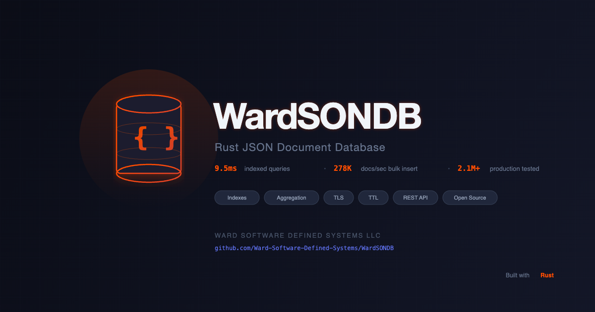

<p align="center">
  
</p>

# WardSONDB

A lightweight, high-performance JSON document database built in Rust. Designed for SIEM and security event workloads — fast ingest, indexed queries, aggregation pipelines, and automatic data retention in a single binary.

## Key Features

- **Single binary, zero dependencies** — no JVM, no cluster setup, no external services
- **High-throughput ingest** — 76,000+ single inserts/sec, 278,000+ docs/sec bulk
- **Secondary & compound indexes** — sub-millisecond indexed lookups at millions of documents
- **Bitmap Scan Accelerator** *(Alpha)* — sub-millisecond aggregation and filtered counts on categorical fields without touching documents
- **Compound Range Scans** *(Alpha)* — equality prefix + range suffix on compound indexes for fast time-windowed queries
- **Aggregation pipelines** — `$match`, `$group`, `$sort`, `$limit`, `$skip` with index-accelerated execution
- **Index-only query paths** — count, distinct, and aggregation operations that never touch documents
- **TTL / auto-expiry** — per-collection retention policies with background cleanup
- **TLS support** — auto-generated self-signed certs or bring your own
- **API key authentication** — simple token-based auth for production deployments
- **Prometheus metrics** — `/_metrics` endpoint for monitoring integration
- **Optimistic concurrency** — `_rev`-based conflict detection on updates

## Performance

Benchmarked at **3.45 million SIEM events** on a Mac Studio (M4 Max, 128GB RAM, 1.8TB SSD):

| Query Type | Time | Docs Scanned | Strategy |
|-----------|------|-------------|----------|
| Bitmap aggregate: count by event_type | **0.096ms** | 0 | bitmap_aggregate |
| Bitmap count: unindexed field (severity=6) | **0.17ms** | 0 | bitmap |
| Bitmap NOT: event_type \u2260 firewall | **0.12ms** | 0 | bitmap |
| Compound range: type + time \u2265 6h (851K matches) | **137ms** | 0 | compound_range |
| Compound range: action + time \u2265 6h (32K matches) | **5.5ms** | 0 | compound_range |
| Compound range: type + time \u2265 1h (0 matches) | **0.042ms** | 0 | compound_range |
| Compound EQ: type + action (2.9M matches) | **485ms** | 0 | compound_eq |
| Indexed equality + sort + limit 50 | **9.5ms** | 50 | index_sorted |
| Indexed count (3M matches) | **432ms** | 0 | index_eq |
| Distinct values (indexed field) | **8ms** | 0 | index_eq |
| Get by ID | **<1ms** | \u2014 | primary |
| Single doc insert throughput | **76,000+/sec** | \u2014 | \u2014 |
| Bulk insert throughput | **278,000+ docs/sec** | \u2014 | \u2014 |

All numbers measured against 3.45 million production SIEM events (firewall, threat, DHCP, DNS, WiFi) on a Mac Studio M4 Max. Run `cargo bench` for reproducible synthetic benchmarks.

## Quick Start

### Build

```bash
cargo build --release
```

### Run

```bash
# Basic — HTTP on port 8080
./target/release/wardsondb

# With TLS (auto-generated self-signed cert)
./target/release/wardsondb --tls

# Production — TLS, custom port, API key auth, bitmap acceleration
ulimit -n 65536
./target/release/wardsondb --tls --port 443 --data-dir /var/lib/wardsondb --api-key "your-secret-key" \
  --cache-size-mb 512 --write-buffer-mb 512 --flush-workers 4 --compaction-workers 4 \
  --bitmap-fields "event_type,severity,status"
```

### Create a collection and insert data

```bash
# Create collection
curl -X POST http://localhost:8080/_collections \
  -H "Content-Type: application/json" \
  -d '{"name": "events"}'

# Insert a document
curl -X POST http://localhost:8080/events/docs \
  -H "Content-Type: application/json" \
  -d '{
    "event_type": "firewall",
    "network": {"src_ip": "10.0.0.1", "action": "block"},
    "severity": "high"
  }'

# Bulk insert
curl -X POST http://localhost:8080/events/docs/_bulk \
  -H "Content-Type: application/json" \
  -d '{"documents": [{"event_type": "dns", "query": "example.com"}, {"event_type": "dhcp", "mac": "AA:BB:CC:DD:EE:FF"}]}'
```

### Create indexes

```bash
# Single-field index
curl -X POST http://localhost:8080/events/indexes \
  -H "Content-Type: application/json" \
  -d '{"name": "idx_event_type", "field": "event_type"}'

# Compound index (for filter + sort queries)
curl -X POST http://localhost:8080/events/indexes \
  -H "Content-Type: application/json" \
  -d '{"name": "idx_type_time", "fields": ["event_type", "received_at"]}'
```

### Query

```bash
# Filter + sort + limit
curl -X POST http://localhost:8080/events/query \
  -H "Content-Type: application/json" \
  -d '{
    "filter": {"event_type": "firewall"},
    "sort": [{"received_at": "desc"}],
    "limit": 50
  }'

# Count matching documents
curl -X POST http://localhost:8080/events/query \
  -H "Content-Type: application/json" \
  -d '{"filter": {"event_type": "firewall"}, "count_only": true}'

# Distinct values
curl -X POST http://localhost:8080/events/distinct \
  -H "Content-Type: application/json" \
  -d '{"field": "network.src_ip", "limit": 100}'
```

### Aggregation

```bash
# Top event types
curl -X POST http://localhost:8080/events/aggregate \
  -H "Content-Type: application/json" \
  -d '{
    "pipeline": [
      {"$group": {"_id": "event_type", "count": {"$count": {}}}},
      {"$sort": {"count": "desc"}},
      {"$limit": 10}
    ]
  }'

# Top blocked IPs with time filter
curl -X POST http://localhost:8080/events/aggregate \
  -H "Content-Type: application/json" \
  -d '{
    "pipeline": [
      {"$match": {"network.action": "block", "received_at": {"$gte": "2026-03-01T00:00:00Z"}}},
      {"$group": {"_id": "network.src_ip", "count": {"$count": {}}, "ports": {"$collect": "network.dst_port"}}},
      {"$sort": {"count": "desc"}},
      {"$limit": 10}
    ]
  }'
```

### Data retention

```bash
# Set 30-day retention on events
curl -X PUT http://localhost:8080/events/ttl \
  -H "Content-Type: application/json" \
  -d '{"retention_days": 30, "field": "_created_at"}'
```

## CLI Options

| Flag | Default | Description |
|------|---------|-------------|
| `--port` | `8080` | Listen port |
| `--data-dir` | `./data` | Data directory |
| `--tls` | `false` | Enable TLS |
| `--tls-cert` | | Custom TLS certificate path |
| `--tls-key` | | Custom TLS key path |
| `--api-key` | | API key (repeatable for multiple keys) |
| `--api-key-file` | | File with API keys (one per line) |
| `--ttl-interval` | `60` | TTL cleanup interval in seconds |
| `--metrics-public` | `false` | Allow unauthenticated access to `/_metrics` |
| `--log-level` | `info` | Log level (trace/debug/info/warn/error) |
| `--log-file` | `wardsondb.log` | Log file path |
| `--bitmap-fields` | | Comma-separated fields for bitmap scan acceleration *(Alpha)* |
| `--verbose` | `false` | Show per-request logs in terminal |
| `--cache-size-mb` | `64` | Block + blob cache size in MiB (shared across all partitions) |
| `--write-buffer-mb` | `64` | Max write buffer size in MiB (total across all partitions) |
| `--memtable-mb` | `8` | Max memtable size in MiB per partition (triggers flush when exceeded) |
| `--flush-workers` | `2` | Number of background flush worker threads |
| `--compaction-workers` | `2` | Number of background compaction worker threads |

## API Overview

Full API documentation: [API.md](API.md)

### System
| Method | Path | Description |
|--------|------|-------------|
| GET | `/` | Server info |
| GET | `/_health` | Health check |
| GET | `/_stats` | Server statistics |
| GET | `/_metrics` | Prometheus metrics |
| GET | `/_collections` | List collections |
| POST | `/_collections` | Create collection |

### Documents
| Method | Path | Description |
|--------|------|-------------|
| POST | `/{collection}/docs` | Insert document |
| POST | `/{collection}/docs/_bulk` | Bulk insert |
| GET | `/{collection}/docs/{id}` | Get by ID |
| PUT | `/{collection}/docs/{id}` | Replace document |
| PATCH | `/{collection}/docs/{id}` | Partial update (JSON Merge Patch) |
| DELETE | `/{collection}/docs/{id}` | Delete document |

### Queries & Aggregation
| Method | Path | Description |
|--------|------|-------------|
| POST | `/{collection}/query` | Query with filter DSL |
| POST | `/{collection}/aggregate` | Aggregation pipeline |
| POST | `/{collection}/distinct` | Distinct field values |
| POST | `/{collection}/docs/_delete_by_query` | Bulk delete by filter |
| POST | `/{collection}/docs/_update_by_query` | Bulk update by filter |

### Indexes & Storage
| Method | Path | Description |
|--------|------|-------------|
| GET | `/{collection}/indexes` | List indexes |
| POST | `/{collection}/indexes` | Create index |
| DELETE | `/{collection}/indexes/{name}` | Drop index |
| GET | `/{collection}/storage` | Storage info |
| PUT | `/{collection}/ttl` | Set retention policy |
| GET | `/{collection}/ttl` | Get retention policy |
| DELETE | `/{collection}/ttl` | Remove retention policy |

## Bitmap Scan Accelerator *(Alpha)*

The bitmap scan accelerator eliminates full-collection scans for queries on low-cardinality categorical fields (e.g., `event_type`, `severity`, `network.action`). It maintains in-memory bitmaps that map field values to document positions, enabling sub-millisecond filtered counts and aggregations at any scale — without touching a single document.

### Enabling

```bash
./target/release/wardsondb --tls \
  --bitmap-fields "event_type,network.action,severity,network.protocol,source_format"
```

### What It Accelerates

| Operation | Without Bitmap | With Bitmap |
|-----------|---------------|-------------|
| Count by event_type (3.45M docs) | 5-15 seconds | **0.096ms** |
| Count where severity = 6 (no index) | 5-15 seconds | **0.17ms** |
| Count where event_type != firewall | 5-15 seconds | **0.12ms** |
| Aggregation: group by event_type | ~250ms (index) | **0.096ms** |

### How It Works

- On startup with `--bitmap-fields`, WardSONDB builds a position map (doc ID to sequential position) and per-field bitmaps from storage
- New inserts/updates automatically maintain the bitmaps after commit
- The query planner uses bitmaps when all filter fields are bitmap-covered and the query is count-only or aggregation
- Bitmap AND/OR/NOT operations run entirely in memory with zero document reads
- Bitmaps are rebuilt from storage on restart — fjall is always the source of truth

### Memory Usage

At 3.45M documents with 5 bitmap fields: **~6.4 MB total** (position map + bitmaps). Memory scales linearly with document count and number of distinct values per field.

### Changing Bitmap Fields

To add, remove, or change bitmap fields, update the `--bitmap-fields` flag and restart WardSONDB. All bitmaps are rebuilt from storage on startup — there is no incremental migration. Rebuild time scales with document count (expect ~30-60 seconds per million documents depending on hardware).

**There is no warning when bitmap fields change between restarts.** Verify bitmaps loaded correctly by checking `GET /_stats` — the `scan_accelerator.bitmap_columns` array should list all expected fields with their cardinality and memory usage.

### Limitations

- **Alpha feature** — API and behavior may change
- Only effective for low-cardinality fields (< ~100 distinct values)
- Auto-detection profiles field cardinality from new inserts only during the sample window (default 10,000 inserts). Existing documents loaded from storage on restart are not profiled. If you restart with millions of existing documents and no `--bitmap-fields` flag, auto-detection won't activate until 10,000 new documents are inserted. For existing datasets, always specify `--bitmap-fields` explicitly
- Bitmap scan is used for count-only queries and aggregations; document-return queries may still use index paths

### Query Planner Priority

The planner selects the best strategy in this order:

1. **IndexSorted** — compound index covers filter + sort, early termination with limit
2. **CompoundEq** — compound index with multiple equality fields
3. **CompoundRange** — compound index: equality prefix + range suffix *(Alpha)*
4. **IndexEq / IndexRange / IndexIn** — single-field index scans
5. **BitmapScan** — bitmap accelerator for categorical field filters
6. **FullScan** — last resort, scans all documents

## Memory Tuning

WardSONDB uses conservative defaults (64 MiB cache, 64 MiB write buffer, 2 flush/compaction workers) suitable for resource-constrained environments. For high-memory systems handling millions of documents, increase these values to avoid write buffer saturation and compaction bottlenecks.

```bash
# Recommended for systems with 32GB+ RAM and heavy write workloads
./target/release/wardsondb --tls \
  --cache-size-mb 512 \
  --write-buffer-mb 512 \
  --memtable-mb 32 \
  --flush-workers 4 \
  --compaction-workers 4
```

| Parameter | Default | High-Memory Recommendation | Purpose |
|-----------|---------|---------------------------|---------|
| `--cache-size-mb` | 64 | 512+ | Read cache — larger values reduce disk reads for repeated queries |
| `--write-buffer-mb` | 64 | 512+ | Write buffer — prevents write saturation during sustained ingest |
| `--memtable-mb` | 8 | 32 | Per-partition memtable — larger values reduce flush frequency |
| `--flush-workers` | 2 | 4 | Parallel flush threads — scale with available CPU cores |
| `--compaction-workers` | 2 | 4 | Parallel compaction threads — scale with available CPU cores |

**Symptoms of undersized configuration:** Console floods with `write halt because of write buffer saturation`, query latencies spike, `/_health` reports `write_pressure: "high"`.

## File Descriptor Limit

WardSONDB requires `ulimit -n` of at least **4096** for production use. The server will warn on startup if the limit is too low and attempt to auto-raise it.

```bash
# Recommended before starting
ulimit -n 65536
```

## Security

WardSONDB is designed for trusted network environments. Below are security considerations for deployment.

| Concern | Severity | Status |
|---|---|---|
| Regex denial of service | **Critical** | **Mitigated** — uses the Rust `regex` crate which guarantees linear-time matching. Pattern length capped at 1024 characters. |
| API key timing attacks | **Critical** | **Mitigated** — API key comparison uses constant-time equality (`subtle` crate) to prevent timing-based enumeration. |
| Unbounded query results | **Medium** | **Mitigated** — query `limit` capped at 10,000. Bulk insert capped at 10,000 documents. Pipeline stages capped at 100. |
| Query resource exhaustion | **Medium** | **Mitigated** — queries timeout after 30 seconds (configurable via `--query-timeout`). Filter nesting capped at depth 20, branches at 1000. |
| No built-in authentication | **Medium** | **Configurable** — API key auth is opt-in via `--api-key` or `--api-key-file`. When not configured, all endpoints are open. Deploy behind a reverse proxy with auth if exposed beyond your LAN. |
| TLS certificate trust | **Info** | Auto-generated self-signed certificates trigger browser warnings. For production, provide your own certs via `--tls-cert` and `--tls-key`. |

**Reporting vulnerabilities:** Open a [GitHub Issue](https://github.com/Ward-Software-Defined-Systems/WardSONDB/issues) with the `security` label or email security@wsds.io.

## Known Issues

| Issue | Status | Description |
|---|---|---|
| High RSS memory usage at scale | **Expected behavior** | At 2M+ documents, the OS-reported RSS can grow to consume 80-90% of system memory. This is standard behavior across all mmap-based storage engines (RocksDB, LMDB, LevelDB) where memory-mapped SST files are counted as RSS by the OS kernel. The actual heap usage is bounded by the configured limits (see Memory Tuning section). The inflated RSS number reflects OS page cache, not application memory consumption — macOS is particularly aggressive about reporting mmap regions as RSS. macOS may terminate the process under memory pressure (Jetsam). Workaround: ensure adequate system memory and avoid running memory-intensive applications alongside WardSONDB on the same host. |
| Full-scan queries slow at 2M+ documents | **Mitigated** | Queries on unindexed fields require a full collection scan. At 2M+ documents, unindexed queries can take 5-15 seconds. **Mitigation:** enable the bitmap scan accelerator (`--bitmap-fields`) for categorical fields — reduces unindexed count queries from seconds to sub-millisecond. For remaining unindexed fields, create secondary indexes. |
| Compaction storm during bulk ingest with many indexes | **Known limitation** | Creating multiple indexes before or during heavy bulk ingest can trigger a compaction storm — fjall's background compaction workers saturate all CPU cores, making the server unresponsive to queries and health checks. This occurs because each inserted document writes to every index, generating massive write amplification. The server remains alive but cannot serve requests until compaction completes. Mitigation: create indexes *after* initial bulk ingest completes, create them one at a time with pauses between each, and monitor the `write_pressure` field in `GET /_health` — defer queries while it reports `"high"`. |

## Roadmap

- [x] Secondary & compound indexes
- [x] Aggregation pipeline ($match, $group, $sort, $limit, $skip)
- [x] TTL / auto-expiry
- [x] API key authentication
- [x] Prometheus metrics
- [x] `$collect` accumulator
- [x] `$distinct` endpoint
- [x] Storage info endpoint
- [x] Query performance optimization (early termination, index-only aggregation)
- [x] Security hardening (regex, timing attacks, resource limits, timeouts)
- [x] Bitmap scan accelerator — sub-millisecond categorical field queries *(Alpha)*
- [x] Compound range scans — equality prefix + range suffix on compound indexes *(Alpha)*
- [ ] RSS memory optimization — investigate fjall mmap behavior at scale
- [ ] Streaming/cursors — large result sets beyond limit/offset
- [ ] Query explain — show scan strategy and index usage
- [ ] Schema validation — optional JSON Schema on collections
- [ ] Performance profiling on Linux and Windows — current benchmarks are macOS only (Apple Silicon)

## Built With

- [Rust](https://www.rust-lang.org/) — systems programming language
- [Axum](https://github.com/tokio-rs/axum) — async web framework
- [fjall](https://github.com/fjall-rs/fjall) — LSM-tree storage engine
- [tokio](https://tokio.rs/) — async runtime

## License

Apache License 2.0 — see [LICENSE](LICENSE) for details.

## Contributing

See [CONTRIBUTING.md](CONTRIBUTING.md) for guidelines.

---

Built by [Ward Software Defined Systems](https://wsds.io)
